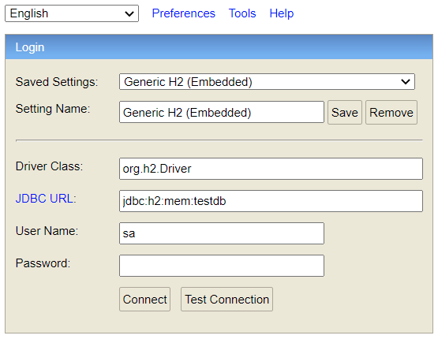

# Spring Boot Transactions System

This is a sample Spring Boot (version 3.0.2) application that manages some banking transactions
stored in an H2 database.

## Built With

* [Maven](https://maven.apache.org/) - Dependency management
* [OpenJDK](https://openjdk.java.net/) - Java Platform, Standard Edition Development Kit.
* [Spring Boot](https://spring.io/projects/spring-boot) - Framework to facilitate bootstrapping and
  development of new Spring applications.
* [IntelliJ IDEA](https://www.jetbrains.com/idea/) - Integrated Development Environment (IDE)
  Written in Java for the development of computer software.

# Running the application locally

There are several ways to run a Spring Boot application on your local machine. One way is to execute
the `main` method in the `package com.transactions.Application` class from your IDE (preferably
IntelliJ).

- Unzip the zip file (if you have one)
- Open a command prompt and change to the directory (cd) where pom.xml is located.
- Open IntelliJ
    - File -> Open... -> Navigate to the folder where you unzipped the zip
    - Select the project
- Right click on "Open as Project" and "Run as Java Application

Alternatively, you can use
the [Spring Boot Maven plugin](https://docs.spring.io/spring-boot/docs/current/reference/html/build-tool-plugins-maven-plugin.html)
like this:

```shell
mvn spring-boot:run
```

## About the service

The service is just a simple API REST service. It uses an in-memory database (H2) to store the data.
The structure of the database is defined in the file ```src/main/resources/schema.sql```, with the
following content:

```sql
DROP
  TABLE IF EXISTS accounts;

DROP
  TABLE IF EXISTS transactions;

CREATE TABLE accounts (
  id int auto_increment primary key,
  account_iban varchar(24) unique not null,
  balance double DEFAULT 0,
  CHECK (balance >= 0)
);

CREATE TABLE transactions (
  id int auto_increment primary key,
  reference varchar(128) unique not null,
  account_iban varchar(24) not null,
  date timestamp,
  amount double,
  fee double,
  description varchar(128),
  channel varchar(8),
  status varchar(7),
  foreign key (account_iban) references accounts(account_iban)
);
```

The tables are in the file ```src/main/resources/data.sql```, with the following content:

```sql
insert into accounts (account_iban, balance)
values
  (
    'ES9820385778983000760236', 3245.54
  );
insert into accounts (account_iban, balance)
values
  (
    'ES6604879643251647165385', 2347.38
  );
insert into transactions (
  reference, account_iban, date, amount,
  fee, description, channel, status
)
values
  (
    '12345A', 'ES9820385778983000760236',
    '2019-07-16T16:55:42.000Z', 193.38,
    3.18, 'Restaurant payment', 'CLIENT',
    'PENDING'
  );
insert into transactions (
  reference, account_iban, date, amount,
  fee, description, channel, status
)
values
  (
    '67890B', 'ES6604879643251647165385',
    '2019-07-16T16:55:42.000Z', 45.25,
    4.24, 'Amazon', 'CLIENT', 'SETTLED'
  );
  ...
```

Here is what this little application demonstrates:

* Full integration with the latest **Spring** framework.
* *Spring Data* integration with JPA/Hibernate with just a few lines of configuration and familiar
  annotations.
* Automatic CRUD functionality against the data source using the Spring *Repository* pattern.
* Demonstrates the MockMVC test framework and associated libraries (Have a look
  at: ```src/test/java/com/inditex/test/domain``` test classes).

Here is a list of endpoints you can call:

### Create a transaction

```
curl --location 'localhost:8080/api/create-transaction' \
--header 'Content-Type: application/json' \
--data '{
"reference":"12345ABCD",
"accountIban":"ES9820385778983000760236",
"date":"2019-07-16T16:55:42",
"amount":193.38,
"fee":3.18,
"description":"Restaurant payment"
}'
```

### Search for a transaction

```
curl --location 'localhost:8080/api/search-transaction/ES9820385778983000760236?sort=desc' \
```

### Transaction status

```
curl --location --request GET 'localhost:8080/api/transaction-status' \
--header 'Content-Type: application/json' \
--data '{
"reference":"12345A",
"channel":"CLIENT"
}'
```

### Running tests in the project

You can run all the tests developed in the ``src/test/java/com/transactions`` folder with your
IDE, by clicking ```mvn test``` or by running them individually in the above folder.

### To view your H2 in-memory database

The 'test' profile runs on an H2 in-memory database. To view and query the database, you can go to
to http://localhost:8080/api/h2. The default username is 'sa' with an empty password, as you can see
from the
in the ```src/main/resources/application.properties``` properties file. Make sure you have the same
configuration as shown in the next image:



Inside the H2 database management page you can see all the data created and stored when using the
API operations.